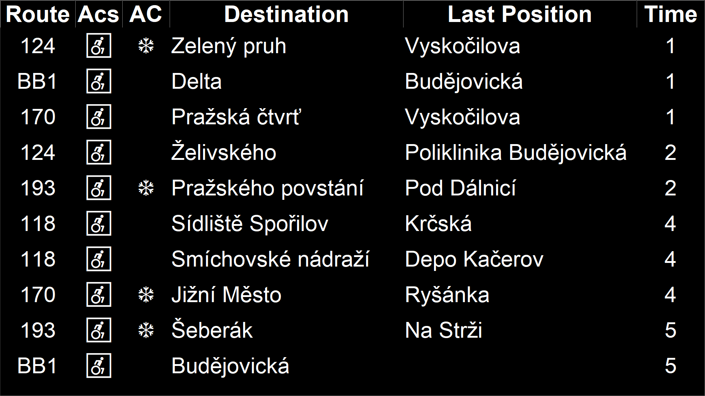

# Prague Public Transport Departure Board


## Description
This project provides a departure board for selected public transport stop. It fetches real-time departure data and displays it in a fullscreen Tkinter application.

## Author
- **Name**: OK7TOM
- **Version**: 0.7
- **Status**: Prototype
- **Date**: 2024-10-31

## Tested On
- **Ubuntu 24.04 LTS** (Python 3.12.3)
- **Windows 10** (Python 3.12.2)

## API Information
This project uses the Golemio API to fetch real-time departure data. For more information about the API, visit the [Golemio API Documentation](https://api.golemio.cz/docs/openapi/).

## Configuration
1. **Install Python 3** and the relevant modules (if needed).
2. **Get your API Secret key** from Golemio.
3. **Insert the Golemio API secret key** in the config file `config.py`.
4. **Modify the refresh rate and blink color** in the config file `config.py` if needed.
5. **Modify the station ID (aswIds)** in the config file `config.py` if needed.
6. **Set up autostart** (for Raspberry Pi):
    ```sh
    sudo nano /etc/xdg/lxsession/LXDE-pi/autostart
    @lxterminal -e python3 /home/pi/main.py
    ```

## Usage
- **Exit fullscreen mode**: Press the `Escape` key.
- **Enter fullscreen mode**: Press the `F11` key.

## Development Environment
- **Editor**: PyCharm Community Edition

## Possible Future Development
- Automatically adjust the font based on screen size.
- Create an executable file for Windows.
